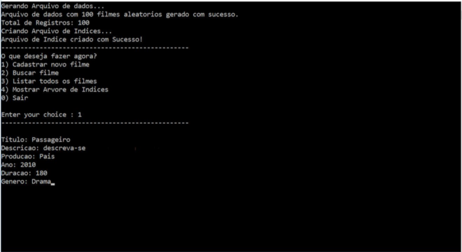
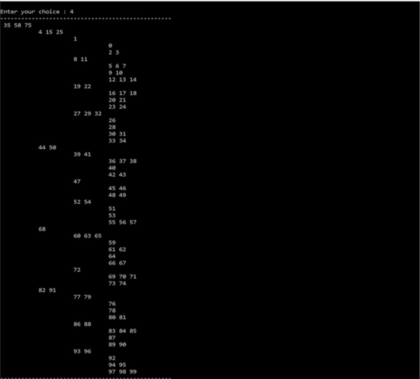

# Movies File Struct

OVERVIEW
--------------------------------------------------
The purpose of this project was to implement an application in C language that can Add, List and Search within a Database using a B-star tree data structure for the [File Structure Organization] course. It was made at the Computer Science undergraduate program from University of São Paulo (ICMC - USP).

PROJECT
--------------------------------------------------
Basically there is a Film database which you can Add, List, Search movies within the database and also View the index tree.

FILE STRUCTURE
--------------------------------------------------
```bash
ID (Movie identification number - int)
TITLE (Movie title - char*)
DESCRIPTION (Movie description - char*)
COUNTRY (Country that the film was made - char*)
YEAR (Release Year - int)
DURATION (Movie duration - int)
GENRE (Movie genre - char*)
```

* The tree has order 4 and its disc page size has 64 bytes.
* The file structure organization has fixed-length fields and registers.

Each time a movie register is inserted in the primary file, its input is also saved in the b-star tree index file.
Inside the database, the movies will be saved in a Binary file called `DADOS.bin`.

EXAMPLE 
--------------------------------------------------




HOW TO COMPILE
--------------------------------------------------
Just use the makefile:

```bash
	make
	make run
```

MORE INFO
--------------------------------------------------
* Please check the files `project specification` and  `project report.pdf` to know more about this project.
